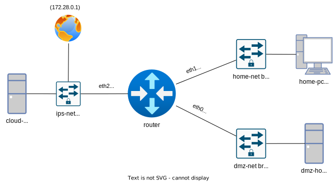

# Iptables Labs

Репозиторий с тасками и песочницей для экспериментов с iptables.

## Запуск playground

**Под WSL не работает. Нужно настоящее ядро.**

Playground состоит из четырёх контейнеров:
- router - маршрутизирует пакеты между "хостами"
- cloud-host - хост в сети провайдера (можно считать в облаке)
- home-pc - домашний компьютер
- dmz-host - хост внутри демилитаризованной зоны

Структура сети выглядит так:


Поднимаем так:  
```bash
cd playground
docker compose up --build -d
```
Если не убирать -d, команда "зависнет" (на самом деле будет ждать вывод, которого никогда не будет).

### Simple example

Теперь заходим на роутер и играем:
```bash
docker compose exec router bash
iptables -I INPUT -p tcp --dport 1337 -j DROP
```

Чтобы обращаться к роутеру в той же сети, то это делать надо из соседнего контейнера:
```bash
docker compose exec home-pc bash

# must connection refused
curl http://router:8080

# must connection timeout
curl http://router:1337
```

### Настройки сети

Чтобы можно было общаться через роутер, надо настроить сеть:

В контейнере `dmz-host`:
```bash
ip ro del default via 192.168.199.1 dev eth0
ip ro add default via 192.168.199.111 dev eth0
```

Схожая команда в контейнере `home-pc`:
```bash
ip ro del default via 192.168.99.1 dev eth0
ip ro default via 192.168.99.111 dev eth0
```

Чтобы заработал интернет на роутере:
```bash
ip ro del default via 192.168.199.1 dev eth0
ip ro add default via 172.28.0.1 dev eth2
```

### MASQUERADE для dmz-net и home-net сетей

```bash
iptables -t nat -A POSTROUTING -o eth2 -j MASQUERADE
```

## Трейсинг iptables

Вставляем `TRACE` правила:
```bash
iptables -t raw -I PREROUTING -p tcp --dport 8080 -j TRACE
iptables -t raw -I PREROUTING -p tcp --sport 8080 -j TRACE
iptables -t raw -I OUTPUT -p tcp --sport 8080 -j TRACE
iptables -t raw -I OUTPUT -p tcp --dport 8080 -j TRACE
```

Начинаем слушать порт:
```bash
ncat -vvv -n -k -l 8080
```

И смотрим хендшейк с помощью команды `xtables-monitor -t`:
```log
PACKET: 2 1266087f IN=eth0 MACSRC=2:42:ac:16:0:2 MACDST=2:42:ac:16:0:3 MACPROTO=0800 SRC=172.22.0.2 DST=172.22.0.3 LEN=60 TOS=0x0 TTL=64 ID=4835DF SPORT=57798 DPORT=8080 SYN 
 TRACE: 2 1266087f raw:PREROUTING:rule:0x2:CONTINUE  -4 -t raw -A PREROUTING -p tcp -m tcp --dport 8080 -j TRACE
 TRACE: 2 1266087f raw:PREROUTING:return:
 TRACE: 2 1266087f raw:PREROUTING:policy:ACCEPT 
PACKET: 2 f2d0e258 OUT=eth0 SRC=172.22.0.3 DST=172.22.0.2 LEN=60 TOS=0x0 TTL=64 ID=0DF SPORT=8080 DPORT=57798 SYN ACK 
 TRACE: 2 f2d0e258 raw:OUTPUT:rule:0x7:CONTINUE  -4 -t raw -A OUTPUT -p tcp -m tcp --sport 8080 -j TRACE
 TRACE: 2 f2d0e258 raw:OUTPUT:rule:0x5:CONTINUE  -4 -t raw -A OUTPUT -p tcp -m tcp --sport 8080 -j TRACE
 TRACE: 2 f2d0e258 raw:OUTPUT:return:
 TRACE: 2 f2d0e258 raw:OUTPUT:policy:ACCEPT 
PACKET: 2 28d75b54 IN=eth0 MACSRC=2:42:ac:16:0:2 MACDST=2:42:ac:16:0:3 MACPROTO=0800 SRC=172.22.0.2 DST=172.22.0.3 LEN=52 TOS=0x0 TTL=64 ID=4836DF SPORT=57798 DPORT=8080 ACK 
 TRACE: 2 28d75b54 raw:PREROUTING:rule:0x2:CONTINUE  -4 -t raw -A PREROUTING -p tcp -m tcp --dport 8080 -j TRACE
 TRACE: 2 28d75b54 raw:PREROUTING:return:
 TRACE: 2 28d75b54 raw:PREROUTING:policy:ACCEPT 
```
